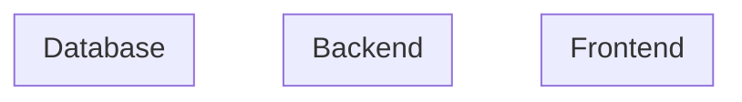

# Architecture

## システム概要図



## 技術スタック

<!-- アプリケーションごとにサブセクションを作成する。アプリケーション構成に応じて追加・削除すること -->

### {App名}（{ディレクトリパス}）

| レイヤー          | 技術 | バージョン | 選定理由 |
| ----------------- | ---- | ---------- | -------- |
| UI フレームワーク |      |            |          |
| ルーティング      |      |            |          |
| データフェッチ    |      |            |          |
| ビルド            |      |            |          |
| UI コンポーネント |      |            |          |
| スタイリング      |      |            |          |
| API クライアント  |      |            |          |
| フォーム          |      |            |          |
| 認証              |      |            |          |
| バリデーション    |      |            |          |
| リンター          |      |            |          |
| フォーマッター    |      |            |          |
| 言語              |      |            |          |

<!-- 以降、アプリケーションごとに同じ形式で追加 -->

### 共通基盤

| レイヤー       | 技術 | バージョン | 選定理由 |
| -------------- | ---- | ---------- | -------- |
| API 定義       |      |            |          |
| パッケージ管理 |      |            |          |

## API設計

### エンドポイント一覧

| メソッド | パス | 説明 | 認証 |
| -------- | ---- | ---- | ---- |
|          |      |      |      |

### 認証・認可方式

-

### リクエスト/レスポンス詳細

#### エンドポイント名

- **Method:**
- **Path:**
- **Request Body:**
- **Response:**
- **エラーケース:**

---

<!-- 以降、エンドポイントごとに同じ形式で追加 -->

## データモデル（物理）

### テーブル一覧

| テーブル | 説明 | 対応エンティティ |
| -------- | ---- | ---------------- |
|          |      |                  |

### ER図

```mermaid
erDiagram
```

### テーブル詳細

#### テーブル名

| カラム名 | 型  | 制約 | 説明 |
| -------- | --- | ---- | ---- |
| id       |     | PK   |      |

---

<!-- 以降、テーブルごとに同じ形式で追加 -->

### インデックス戦略

| テーブル | インデックス名 | カラム | 種別 | 用途 |
| -------- | -------------- | ------ | ---- | ---- |
|          |                |        |      |      |

### API ↔ データモデル マッピング

| APIエンドポイント | 操作するテーブル | CRUD |
| ----------------- | ---------------- | ---- |
|                   |                  |      |

## ディレクトリ構成

```
project/
├──
└──
```

## インフラコスト概算

<!-- Web検索でクラウドプロバイダの公式料金ページから最新単価を調べて算出する。
     Inception の想定ユーザー規模を前提に、最小構成と想定規模の2パターンで算出する。 -->

### 前提条件

- 想定ユーザー規模:
- 想定リクエスト数:
- 想定データ量:

### コスト内訳

| コンポーネント | サービス | 最小構成（月額） | 想定規模（月額） | 備考 |
| -------------- | -------- | ---------------- | ---------------- | ---- |
| コンピュート   |          |                  |                  |      |
| データベース   |          |                  |                  |      |
| ストレージ     |          |                  |                  |      |
| ネットワーク   |          |                  |                  |      |
| CDN            |          |                  |                  |      |
| 認証           |          |                  |                  |      |
| その他         |          |                  |                  |      |
| **合計**       |          |                  |                  |      |

## NFR関連の意思決定

### パフォーマンス

- レスポンスタイム目標:
- スループット目標:
- キャッシュ戦略:

### スケーラビリティ

- スケーリング方針:

### セキュリティ

- 暗号化:
- 脆弱性対策:

### 可用性・信頼性

- 稼働率目標:
- 監視・アラート:

## 技術的な意思決定

### 決定1:

- **選択肢A:**
- **選択肢B:**
- **決定:** 選択肢X。理由:
